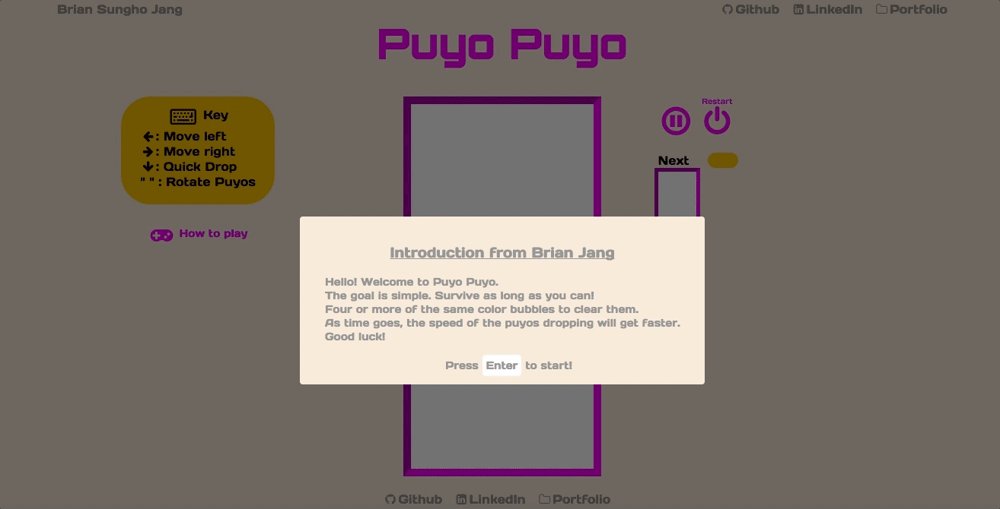

# Puyo Puyo

Puyo-Puyo is a Tetris-like puzzle video game built using JavaScript and HTML5 Canvas.

[Play Puyo Puyo][puyopuyo]

[puyopuyo]: http://brianjang.us/puyo-puyo/



The game follows these rules:
1. Combine 4 or more of the same color pieces to clear
2. Velocity of the Puyo will increase as the time goes
3. The goal is to get the highest score.

## Features and Implementation

### Game rendering
  - Incorporated `HTML5 Canvas` to render objects, and used `window.requestAnimationFrame` method to show smooth and polished motions of the objects

  #### lib/game_view.js:
  ```JavaScript

  play() {
    this.game.step();
    this.game.draw(this.ctx, this.nextPuyoCtx);

    if (!this.game.over) {
      this.gameStart = requestAnimationFrame(this.play);
    }

    this.game.gameOver();
  }
  ```

### Puyo clear logic
  This is where things get difficult. In Tetris, clearing logic is simple, clear lines. However, in Puyo Puyo, you have to check the entire board to see where four or more of the same color Puyos are together.

  This is where `Breadth First Search` comes to rescue:

  #### lib/board.js:
  ```JavaScript
  clearPuyos() {
    this.puyos.forEach((puyo) => {
      let count = 1;
      let queue = [puyo];
      let puyoToDestroy = [puyo];
      let el;
      while (queue.length > 0) {
        el = queue.shift();
        el.neighbors(this).forEach( (pos) => {
          const neighbor = this.grid[pos[1]][pos[0]]
          if (neighbor &&
              el.color === neighbor.color &&
              !puyoToDestroy.includes(neighbor)) {
            count += 1;
            queue.push(neighbor);
            puyoToDestroy.push(neighbor);
          }
        });
      }

      if (count >= 4) {
        this.score += puyoToDestroy.length * 10;

        puyoToDestroy.forEach((puyoToDelete) => {
          this.grid[puyoToDelete.row][puyoToDelete.col] = null;
          const idx = this.puyos.indexOf(puyoToDelete);
          this.puyos.splice(idx, 1);
        });
      }
    });
  }
  ```


### Bonus features

- [ ] Add rock pieces that will only disappear if neighboring pieces pop to make the game more difficult
- [ ] Create AI player to vs against.
- [ ] Make it multiplayer game to vs against each other.
